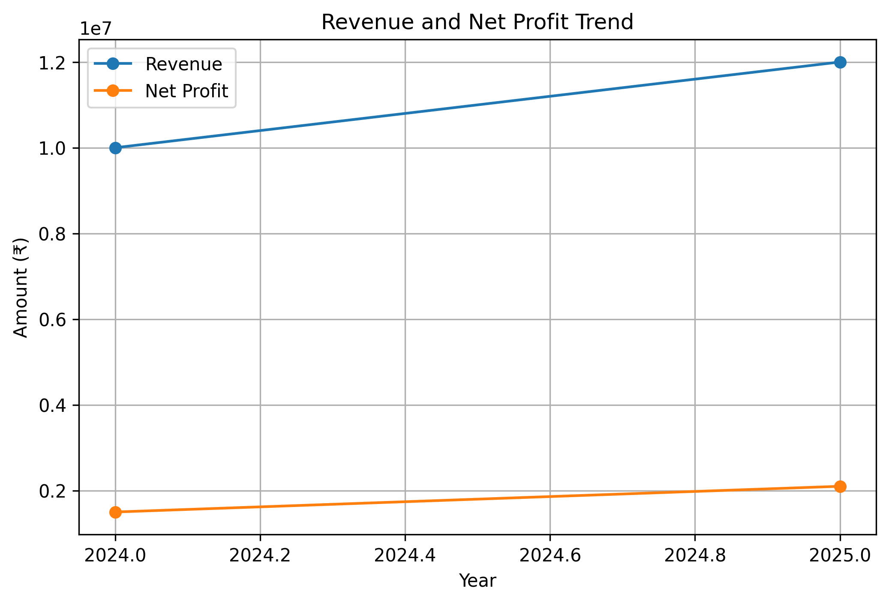

# 🤖 AI-Based Financial Analysis Assistant

An AI-assisted financial analysis project that processes company financial data, calculates key financial ratios, identifies year-on-year trends, and generates simple business insights.

## 🎯 Objective

The objective of this project is to demonstrate how Python and AI-assisted analysis can be used to understand a company's financial performance in a simple and structured way.

## 📊 Features

- Revenue analysis
- Net profit analysis
- Year-on-year revenue growth
- Year-on-year profit growth
- Net profit margin
- Current ratio
- Debt-to-equity ratio
- Automated financial observations
- AI prompt framework for generating business explanations

## 🛠️ Tools & Technologies

- Python
- CSV
- GitHub
- AI / Prompt Engineering
- Financial Analysis

## 📁 Project Structure

```text
AI-Financial-Analysis-Assistant/
│
├── README.md
├── financial_analysis.py
├── financial_trend.png
│
├── data/
│   └── financial_data.csv
│
└── prompts/
    └── financial_analysis_prompt.md
## 📈 Financial Metrics

| Metric | Purpose |
|---|---|
| Net Profit Margin | Measures profitability |
| Current Ratio | Measures short-term liquidity |
| Debt-to-Equity | Measures financial leverage |
| Revenue Growth | Measures change in revenue |
| Profit Growth | Measures change in net profit |

## 🔍 Example Analysis

The project uses sample company financial data for demonstration.

The Python program processes the data and produces financial ratios and basic observations.
### 📊 Financial Trend



## 🤖 AI Component

An AI prompt framework is included to convert numerical financial results into simple business-language explanations.

The AI component is designed to:

- Explain financial performance
- Identify strengths
- Highlight areas of concern
- Provide a balanced overall assessment

The project does not provide investment recommendations.

## 🚀 Future Improvements

- Connect the project to an AI API
- Add interactive charts
- Add Excel file upload
- Build a Streamlit web application
- Add more financial ratios
- Compare multiple companies

## 👩‍💼 Project Focus

This project combines:

**Finance + Financial Analysis + Python + AI + Prompt Engineering**

It is designed as a portfolio project demonstrating the practical application of AI in financial analysis.
